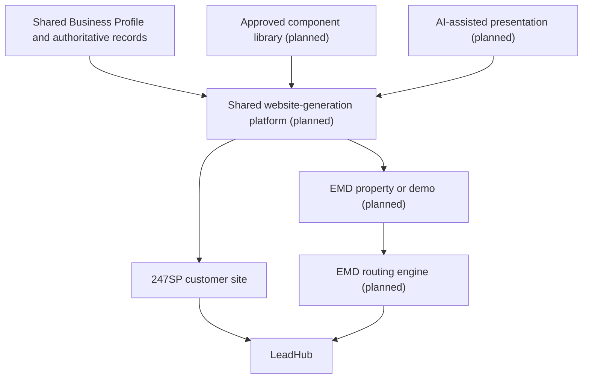

# 24/7SP Website Generation Architecture

## Status

Planned architecture. The current repository has 247SP onboarding, one starter template, generated page records, private previews, customer-safe website management, an internal website editor, domain workflows, and website lead capture. It does not yet have the component CMS, portable site lifecycle, bidirectional conversion workflows, or revision and approval system described here.

---

# Purpose

24/7 Sales Partner and EMD Network need one shared website-generation platform. A website is a presentation layer for approved business facts, not the primary source of those facts and not the entire 247SP product.

The platform should create custom-looking, conversion-focused sites while keeping authentication, LeadHub ingestion, analytics, security, tenant isolation, and deployment behavior controlled by repository-owned services.

Related documents:

* `docs/247sp-product-spec.md`
* `docs/product-structure.md`
* `docs/database-plan.md`
* `docs/internal-mcp-and-integration-access-strategy.md`



---

# Architectural Layers

## Layer 1 - Structured Business Data

Business data is collected through onboarding and profile management and stored in authoritative structured records. Migration `021_shared_business_profile.sql` established the initial Shared Business Profile schema and was staging validated.

The website must consume approved facts instead of embedding the only copy of those facts inside generated code.

Authoritative business data includes or may eventually include:

* Identity and public contact information
* Services and service areas
* Hours and exceptions
* FAQs and pricing guidance
* Appointment, transfer, emergency, and escalation rules
* Notification preferences
* Branding and trust information
* Marketing and SEO information
* Approved claims, images, and media

Migration 021 does not contain every future category. Logos, brand colors, social links, licenses, certifications, insurance, awards, guarantees, testimonials, review references, before-and-after media, target customers, conversion goals, differentiators, competitive advantages, SEO cities, keywords, and media libraries still require source-of-truth and schema review.

Those concepts must be evaluated against existing business, branding, website, service, media, and integration records and against future structured child tables. They must not all be added directly to `business_profiles` or duplicated into parallel sources of truth.

## Layer 2 - Approved Component Library

The component library is planned. Current generated sites use the implemented `starter_local_service` template and existing page/override records.

Planned component categories and approved variants include:

| Category | Proposed variants |
| --- | --- |
| Navigation | Standard, transparent, sticky, minimal |
| Hero | Split, full-background, image-left, video, emergency-service, offer-focused |
| Services | Icon grid, cards, alternating image sections, accordion, large feature blocks |
| About | Story, timeline, team, mission |
| Testimonials | Carousel, masonry, cards, video testimonials |
| Trust | Certifications, partner logos, statistics, guarantees |
| Gallery | Before-and-after, standard gallery, slider, masonry |
| FAQ | Accordion, two-column, searchable |
| CTA | Full-width, floating, banner, inline, mobile sticky CTA |
| Contact | LeadHub form, map, phone-first, emergency contact |
| Footer | Multiple approved footer variants |

Component implementation belongs in the repository. Database records may select a component and variant, but must not store arbitrary executable component code.

## Layer 3 - AI-Assisted Presentation

Codex or another approved internal AI agent may eventually:

* Select approved components and variants
* Arrange sections
* Apply approved typography and brand colors
* Choose image placement
* Establish visual hierarchy
* Draft marketing copy grounded in approved facts
* Generate a site brief
* Assemble a proposed revision

AI may not independently replace or modify authentication, LeadHub ingestion, analytics foundations, security, environment variables, database structure, shared platform services, authorization, tenant isolation, provider credentials, or core business logic.

The governing rule is:

> AI has flexibility over presentation, but not over platform functionality.

---

# Facts And Presentation

Authoritative business facts and channel-specific presentation are separate layers.

| Concept | Authoritative layer |
| --- | --- |
| Business hours | Shared Business Profile |
| Services offered | Existing business service records |
| Travel radius | Existing 247SP configuration |
| FAQs | Shared Business Profile |
| Licenses and certifications | Proposed structured trust records |
| Homepage headline | Website presentation record |
| Hero variant | Proposed website page definition |
| Hero image placement | Proposed website page definition |
| Navigation variant | Proposed website presentation record |
| Lead routing | LeadHub/routing configuration |
| Transfer behavior | Shared Business Profile |
| Provider IDs | Proposed provider integration records |

Shared facts may produce different channel-specific wording without becoming duplicated sources of truth. Website language may be marketing-focused, voice responses conversational, SMS wording shortened, and schema markup factual and structured. Every version must remain grounded in approved facts.

---

# Internal CMS Direction

The MVP is not a Wix- or WordPress-style customer drag-and-drop builder. The planned CMS stores structured page definitions, for example:

```text
Page: Home

Hero
Variant: Split

Services
Variant: Icon Cards

Trust
Variant: Certification Strip

Testimonials
Variant: Carousel

FAQ
Variant: Accordion

CTA
Variant: Full Width

Contact
Variant: LeadHub Form
```

Customer-managed business facts include hours, services, FAQs, service areas, contact details, pricing guidance, notification preferences, and approved trust information.

FDV-managed presentation includes page composition, component variants, section order, typography, images, theme choices, visual hierarchy, draft revisions, and publishing.

Changes to shared facts should flow to consuming channels without requiring customers to edit raw pages or source code.

---

# Proposed Website Data Model

The following are conceptual entities only and require a repository and schema audit before implementation:

* `sites`
* `site_pages`
* `site_page_sections`
* `site_themes`
* `site_revisions`
* `site_generation_briefs`
* `site_build_jobs`
* `site_deployments`
* `component_definitions`
* `component_variants`
* `site_assets`
* `site_conversion_events` or an equivalent audit model

Repository-owned responsibilities:

* Component templates
* Shared CSS and JavaScript
* Shared LeadHub form integration
* Authentication integrations
* Analytics and tracking
* Validation and SEO helpers
* Image optimization
* Navigation and footer logic
* Deployment tooling

Database-owned configuration:

* Site identity and purpose
* Page definitions, section order, component selection, and variants
* Business-specific configuration and content references
* Theme selection
* Draft and published revisions
* Build and deployment status
* Customer, business, EMD, domain, and routing associations
* Conversion history

---

# Standard LeadHub Ingestion

Website submissions are planned as controlled inbound ingestion, not broad customer API access.

A standardized write contract may include:

```text
site_id
business_id
source
form_type
page_url

visitor
  name
  email
  phone

lead_details
  requested_service
  message
  preferred_contact

tracking
  utm_source
  utm_medium
  utm_campaign
  referrer

consent
  required acknowledgments
```

LeadHub responsibilities are to validate the registered site, resolve the authoritative business, create or match the contact, create or update the lead, record submission history, trigger notifications, apply spam checks and routing, preserve attribution, prevent duplicates where supported, and surface follow-up needs.

Security requirements:

* Narrow, write-oriented endpoint
* No general LeadHub read access
* Do not trust submitted `business_id` by itself
* Registered site identity determines business association
* Rate limiting and replay/duplicate protection
* Permitted-domain or site-credential validation
* No exposed API keys in website code
* Auditable correlation or submission ID

The existing `LeadHub::capture247spWebsiteSubmission()` path is the implemented starting point. The standardized site contract and broader routing model are planned.

---

# Shared 247SP And EMD Platform

24/7SP and EMD Network should share site briefs, the component library, page generation, themes, analytics, SEO helpers, LeadHub form components, tracking, deployment, revision management, validation, and image handling.

The website platform must not be hardcoded as belonging exclusively to either product.

Routing differs by operating mode:

```text
24/7SP site
  -> Lead assigned directly to customer business

EMD Network site
  -> Lead enters EMD routing engine
  -> Lead assigned by service, geography, buyer, and routing rules
```

Proposed site-purpose values:

* `business_owned`
* `emd_lead_property`
* `emd_demo`
* `internal_demo`
* `internal_marketing`

These values are proposed, not implemented.

---

# Portable Website Asset Model

A website is a platform-managed asset that may move between approved operating modes while retaining, where appropriate, page composition, components, variants, theme, structured content references, revision history, build history, deployment history, SEO structure, LeadHub form framework, analytics framework, and domain configuration where legally and technically permitted.

The following concepts remain separate:

* Site build
* Site purpose
* Site lifecycle
* Site ownership or control
* Customer relationship
* Business association
* Domain ownership
* Lead-routing mode
* CRM data
* Analytics ownership
* Provider accounts

Changing one must not automatically transfer the others.

---

# Bidirectional Lifecycle

The planned lifecycle is approval-controlled:

```text
EMD or internal demo
  -> converted to purchased 247SP site
  -> operated as active customer site
  -> customer cancellation
  -> eligible site reviewed for EMD conversion
```

Proposed lifecycle values include `draft`, `demo`, `pending_customer`, `pending_approval`, `active`, `suspended`, `cancellation_pending`, `transfer_review`, `conversion_pending`, and `archived`.

These values are proposed. Subscription status and site lifecycle must not use the same field. A canceled subscription may have a grace period; a demo may exist without a subscription; an EMD property may be active without a 247SP subscription; and conversion may require approval before activation.

## EMD Demo To 247SP

EMD Network or an internal demo mode may create demonstration websites from service category, location, a prospect-specific brief, approved public or prospect-supplied facts, approved placeholder or licensed media, component variants, and demonstration routing.

A demo must not invent licenses, certifications, years in business, review counts, awards, guarantees, pricing, emergency availability, staff information, or unsupported service capabilities. It remains internally classified as a demo until approved conversion.

Approved reusable work may be retained: page structure, component selections and variants, theme, responsive design, approved imagery, site brief, draft revisions, validation work, LeadHub form integration, SEO structure, and appropriate deployment configuration.

Conversion must create or link the customer account and Business Profile; verify business facts, branding, media, consent language, privacy policy, and terms; make a domain decision; configure email, phone, analytics, and tracking; move lead routing from demo/EMD routing to the customer business; obtain customer approval; and record an audit event.

The site must not remain connected to EMD routing unless separately approved.

## Canceled 247SP Site To EMD

An eligible canceled 247SP site may be reviewed for conversion to an EMD property. Conversion is not immediate, automatic, or guaranteed.

```text
Active 247SP customer site
  -> customer cancels
  -> cancellation and transfer review
  -> customer access and routing removed
  -> content, assets, domain rights, and data reviewed
  -> eligible site converted to EMD property
  -> routing changed to EMD
  -> validation, approval, and republication
```

Eligibility review covers contract terms, domain rights, content and media rights, market and SEO value, service category, geography, EMD demand, data-separation feasibility, and internal approval. Alternatives are suspension, archive, retention hold, policy-based deletion, or later review.

Conversion must separately review the site build and configuration, FDV-owned and customer-owned domains, Business Profile data, customer CRM data, leads, conversations, analytics, tracking numbers, email accounts, branding, logos, photographs, testimonials, reviews, licenses, certifications, guarantees, personal information, and third-party integrations.

Customer-specific data that cannot lawfully or contractually transfer must be removed or replaced. Customer CRM records and communications remain isolated from the EMD property.

On approved conversion, site purpose changes, customer routing and contact details are removed, EMD routing is configured, claims are reviewed, analytics/tracking are reassigned, an EMD property identity is assigned, validation is completed, and the conversion is audited.

---

# Domain Ownership

Domain ownership is reviewed separately from website ownership or control.

* An FDV-owned domain may remain with the platform and be assigned to an EMD property when the applicable domain policy permits it.
* A customer-owned or bring-your-own domain must not be retained, redirected, or reassigned without contractual authority and customer authorization.
* Website structure may be retained even when the former customer's domain must be disconnected.
* DNS, transfer, release, redirect, expiration, and ownership handling follow the documented domain policy.

---

# Revision, Approval, And Audit

The planned publishing lifecycle is:

```text
Business data
  -> site brief
  -> draft revision
  -> automated validation
  -> internal review
  -> approval
  -> publish
  -> audit record
```

Future publishing should support preview, validation, approval, publication, previous-version restoration, actor and agent identity, correlation IDs, build status, deployment status, and audit history.

Audit planning includes site creation source, original/current product, purpose changes, routing changes, customer/business/domain association changes, both conversion directions, data-separation confirmation, content-removal confirmation, approval, publication, suspension, archival, and restoration.

AI agents may prepare a revision or conversion draft but may not silently transfer a customer site, change lead routing, publish an EMD property, convert a demo, reassign a domain, remove customer access, or repurpose customer content. Those actions require explicit internal approval and an audit record.

Proposed conversion audit data includes original and new purpose, original and new routing mode, administrator or agent, customer business, approval status, conversion time, published revision, and correlation ID.

---

# Open Architecture Questions

* Which existing generated-website records evolve into the proposed `sites` model versus remain compatibility records?
* Which trust, media, branding, and SEO concepts already have an authoritative record and which require child tables?
* What contract and retention terms permit FDV to reuse site structure, content, media, or an FDV-owned domain after cancellation?
* Which analytics properties are customer-owned, FDV-owned, or recreated during conversion?
* What grace, retention, archive, deletion, and restoration periods apply to each lifecycle state?
* Which validation gates are automated and which always require human approval?
