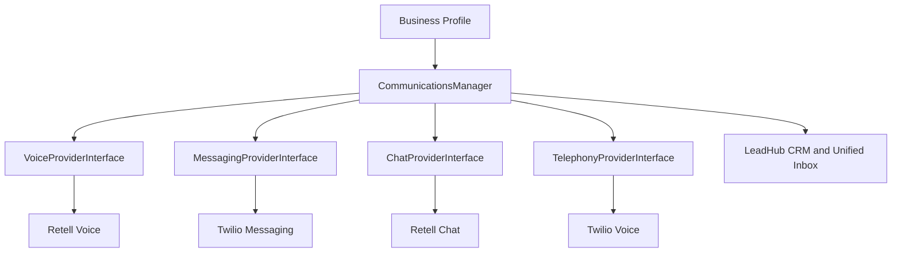

# Ultimate Back Office Database Plan

## Purpose

This document defines the database blueprint for Ultimate Back Office before development begins.

The goal is to give Codex clear direction so the database is built around the correct long-term product model.

This is a planning document, not final SQL.

---

# 1. Product Model

Ultimate Back Office has three commercial levels:

1. Modular products
2. Full OS
3. Enterprise

LeadHub is the central dashboard, CRM, and unified conversation layer for all products.

Every business that purchases any module receives LeadHub access.

---

## 1.1 Modular Products

Modular users:

* Have one business.
* Have one user.
* Cannot add employees/users.
* Must upgrade to Full OS to add additional users.

Standalone modular products:

```text
24/7 Sales Partner
EMD Network
Super Simple Payments
Tell Us How We Did
Know Your Numbers
```

Rules:

* LeadHub is included with every purchased module.
* Know Your Numbers requires Super Simple Payments.
* 24/7 Sales Partner includes LeadHub.
* EMD Network includes LeadHub.
* Super Simple Payments includes LeadHub.
* Tell Us How We Did includes LeadHub.
* 24/7 Sales Partner also includes a done-for-you website, domain, professional email, local business phone number, AI receptionist, business texting, AI website chat, and unified conversation inbox.

---

## 1.2 Full OS

Full OS pricing:

```text
$375/month per business
$37/month per additional user
```

Full OS includes:

```text
LeadHub
24/7 Sales Partner
EMD access
Super Simple Payments
Tell Us How We Did
Know Your Numbers
```

Additional fees:

```text
Stripe processing fees
EMD pay-per-lead charges
```

Full OS does not charge the modular SSP invoice fee.

---

## 1.3 Enterprise

Enterprise pricing:

```text
$1,200/year enterprise fee
$375/month per business
$37/month per additional user
```

Enterprise is the only tier that allows one login to manage multiple businesses.

Each Enterprise location/business is still its own business record.

Enterprise also needs support for parent-level expenses that are not tied to one specific business.

Example:

```text
Parent: Dalba Service Group

Businesses:
- Dalba Plumbing Albany
- Dalba Plumbing Syracuse
- Dalba Plumbing Rochester

Parent-level expense:
- Payroll
- Insurance
- Shared admin
```

---

# 2. Naming Rules

Use:

```text
businesses
```

for paying UBO users.

Use:

```text
contacts
```

for the people or companies a business serves.

Use:

```text
portal_users
```

for future customer-facing users.

Avoid using:

```text
customers
```

as a database term for UBO-paying accounts.

---

# 3. Core Database Principles

## 3.1 Multi-Tenant Rule

Most business-facing records must include:

```text
business_id
```

Examples:

```text
contacts
estimates
invoices
expenses
review_requests
website_leads
appointments
jobs
```

## 3.2 Enterprise Rule

A user cannot access multiple businesses unless Enterprise access exists.

## 3.3 Customer Portal Rule

V1 customer interaction uses secure token links.

Long-term, customer portal users may log in and see all UBO businesses they have interacted with.

Example:

```text
My Service Professionals

- ABC Plumbing
- XYZ Electric
- Green Lawn Care
```

## 3.4 API-Ready Rule

UBO v1 is a responsive web app, but the structure should preserve future API support for:

```text
iOS app
Android app
Field tech app
Customer portal app
```

Business logic should be separated from presentation where practical.

## 3.5 Business Profile Configuration Rule

The Business Profile is the configuration root for 247SP front-office behavior.

One Business Profile configures:

```text
Website
AI Receptionist
SMS Assistant
Website Chat
LeadHub routing
Transfer rules
Escalation rules
```

Business Profile records should store business-owned settings and rules. Provider-specific IDs, webhook payloads, API response data, transcripts, call IDs, message IDs, and chat IDs should live in communications tables owned by internal UBO services.

## 3.6 Business Facts And Presentation Rule

The Shared Business Profile and existing business/service records own authoritative facts. Channel-specific presentation records may select wording, components, and layout, but must reference rather than replace those facts.

Examples:

| Concept | Authoritative layer |
| --- | --- |
| Business hours and FAQs | Shared Business Profile |
| Services | Existing business service records |
| Travel radius | Existing 247SP configuration |
| Homepage headline and hero variant | Website presentation records |
| Lead routing | LeadHub/routing configuration |
| Provider IDs | Provider integration records |

Migration 021 is complete and staging validated, but it is not the final schema for branding, trust, marketing, SEO, images, or media. Each future category must be reviewed against existing business, branding, website, service, media, and integration records before adding fields or structured child tables. Avoid parallel sources of truth.

---

# 4. Core Platform Tables

## users

Represents platform login users.

Suggested fields:

```text
id
first_name
last_name
email
phone
password_hash nullable
otp_enabled
status
last_login_at
created_at
updated_at
```

Notes:

* V1 authentication should use OTP/magic links.
* Password support may be added later.

---

## businesses

Represents each business using UBO.

Suggested fields:

```text
id
brand_id nullable
business_name
legal_name nullable
owner_user_id
phone
email
address_line_1
address_line_2
city
state
postal_code
country
is_public_physical_location
legal_structure_id
primary_category_id
ein nullable
tax_structure nullable
status
created_at
updated_at
```

Required at signup:

```text
business name
owner name
owner email
phone
full address
whether the address is a public physical location
business type/legal structure
primary business category
```

EIN and tax structure should only be required for businesses using SSP or KYN.

---

## business_users

Connects users to businesses.

Suggested fields:

```text
id
business_id
user_id
employee_id nullable
role_id
status
is_owner
created_at
updated_at
```

Rules:

* Modular accounts may only have one user.
* Full OS and Enterprise accounts may add users.
* Additional users are billed at $37/month/user.

---

## employees

Represents workers/employees of a business.

Employees are separate from users.

Suggested fields:

```text
id
business_id
user_id nullable
first_name
last_name
email nullable
phone nullable
employee_type
status
created_at
updated_at
```

Rules:

* Not every employee needs a login.
* Employees may later be linked to user accounts.
* Employees will support future scheduling, dispatch, payroll, field tech, Twilio numbers, and time tracking.

---

## enterprise_accounts

Represents the parent account for Enterprise users.

Suggested fields:

```text
id
name
primary_owner_user_id
stripe_customer_id
annual_fee_subscription_id
status
created_at
updated_at
```

---

## enterprise_businesses

Connects enterprise accounts to businesses.

Suggested fields:

```text
id
enterprise_account_id
business_id
status
created_at
updated_at
```

---

## enterprise_expenses

Parent-level Enterprise expenses.

Suggested fields:

```text
id
enterprise_account_id
vendor_name
expense_date
amount_cents
expense_category_id nullable
description nullable
created_by_user_id
status
created_at
updated_at
```

Rules:

* Used for parent-level expenses not tied to one business.
* Example: shared payroll, insurance, admin, management costs.

---

# 5. Business Setup Tables

## legal_structures

Examples:

```text
Sole Proprietorship
LLC
Corporation
S Corporation
Partnership
Nonprofit
Other
```

Suggested fields:

```text
id
name
description
is_active
sort_order
created_at
updated_at
```

---

## business_categories

Main business category.

Examples:

```text
Plumbing
Electrical
HVAC
Landscaping
Cleaning
Roofing
Other
```

Suggested fields:

```text
id
name
slug
description
is_active
sort_order
created_at
updated_at
```

Rules:

* Each business selects one primary category.

---

## business_sub_services

Optional services under a main category.

Examples:

```text
Drain Cleaning
Leak Repair
Water Heater Installation
Lawn Mowing
Snow Removal
```

Suggested fields:

```text
id
business_category_id
name
slug
description
is_active
sort_order
created_at
updated_at
```

---

## business_selected_services

Services selected by each business.

Suggested fields:

```text
id
business_id
business_sub_service_id
created_at
```

---

## business_profiles

Represents the shared operational profile for one business. Sprint 8.7 Milestone 2 implements this as the provider-neutral configuration root for 247SP front-office channels without introducing communications provider tables.

Current implementation is migration `021_shared_business_profile.sql`.

```text
id
business_id
lifecycle_status
public_display_name nullable
website_url nullable
timezone nullable
default_language
short_description nullable
long_description nullable
primary_greeting nullable
value_proposition nullable
tone nullable
personality nullable
prohibited_claims nullable
appointment_requests_enabled
automatic_booking_enabled
minimum_notice_minutes nullable
default_appointment_duration_minutes nullable
emergency_service_enabled
readiness_snapshot_json nullable
profile_completed_at nullable
activated_at nullable
created_at
updated_at
```

Foreign keys:

* `business_profiles.business_id` -> `businesses.id`

Indexes:

* Unique: `business_id`
* Unique: `id, business_id`
* Index: `lifecycle_status`
* Index: `timezone`

Milestone 2 child tables:

```text
business_profile_hours
business_profile_hour_exceptions
business_profile_faqs
business_profile_pricing_guidance
business_appointment_rules
business_transfer_rules
business_escalation_rules
business_notification_preferences
```

Backfill:

* One `business_profiles` row is inserted per existing `businesses` row.
* `public_display_name` is copied from `businesses.business_name`.
* `short_description` and `long_description` are copied from `247sp_business_content.business_description` and `247sp_business_content.about_company`.
* If unexpected duplicate `247sp_business_content` rows exist for a business, the migration uses the lowest content `id` as the deterministic source row.
* `timezone` remains nullable; profiles stay in `draft` until explicit profile completion data exists.

Rules:

* One business has one Shared Business Profile.
* The Business Profile stores business-owned configuration and routing intent.
* Provider-specific identifiers belong in communications tables, not in `business_profiles`.
* Website, AI Receptionist, SMS Assistant, Website Chat, LeadHub routing, transfer rules, and escalation rules should all resolve through the Business Profile when their services are implemented.
* Service references must link to existing `sub_services` or `business_custom_services`; do not create a second service catalog.
* Existing service-area scalar fields remain authoritative until a future milestone adds genuinely repeating geographic records. Customers-visit mode is stored in `businesses.is_public_physical_location`; business-travels mode and travel radius are stored in `247sp_website_configurations.service_area_business`, `service_area_radius_miles`, and `service_area_radius_is_custom`.
* Profile child tables store both `business_id` and `business_profile_id`; migration 021 enforces agreement through composite foreign keys to `business_profiles(id, business_id)`.
* Profile lifecycle values are application-owned strings. The intended set is `draft`, `in_review`, `ready`, `active`, and `incomplete`; the database default is `draft`, and existing businesses are not backfilled as ready or active.
* Hours rows support closed days, 24-hour days, overnight hours, split shifts, and dated exceptions. Application validation must reject contradictory rows such as closed rows with times, 24-hour rows with times, or rows marked both closed and 24-hour.
* Appointment, transfer, and escalation rules may reference either a global `sub_services` row or a `business_custom_services` row, or neither for profile-wide rules. Application validation must reject rows that reference both service types and must confirm custom services belong to the same business.
* Notification destinations are nullable so drafts can be saved. Application readiness validation must treat enabled email or SMS notifications without a destination as incomplete.

Sprint 8.7 Milestone 4 application service:

* `private/classes/SharedBusinessProfile.php` is the implemented application boundary for migration 021 records.
* Every public method authorizes the acting user against the target business or the existing internal Admin/Super Admin role.
* Profile and child writes use prepared statements, transactions, a profile-row lock, ownership validation, readiness recalculation, lifecycle demotion, and `activity_logs` audit summaries.
* Readiness is calculated from current `businesses`, selected/custom service records, `247sp_website_configurations`, and migration 021 records. `readiness_snapshot_json` is refreshed after mutations but is not an authoritative completion source.
* No schema change was required for Milestone 4. See `docs/shared-business-profile-service-layer.md`.
* Milestone 4 staging runtime validation passed on deployed commit
  `d11bd0e7d14b9d9dd432f3ce244a9b2bbebfafb7`. Repository/database reconciliation
  passed. Milestone 5 later completed and staging validated without changing migration
  021. Its final validated/deployed `main` state is
  `ea81194e7d853782f927fdf58ed65eecd6473a7f` after follow-up fixes.

---

# 6. Product Access and Billing Tables

## modules

Initial modules:

```text
lead_hub
247sp
emd
ssp
tuhwd
kyn
full_os
enterprise
```

Suggested fields:

```text
id
module_key
name
description
is_standalone
is_active
created_at
updated_at
```

---

## business_modules

Controls which modules a business can access.

Suggested fields:

```text
id
business_id
module_id
status
activated_at
deactivated_at nullable
created_at
updated_at
```

Rules:

* Lead Hub is included with every purchased module.
* KYN requires SSP.
* Full OS includes all modules.
* EMD access may be included, but individual leads are still purchased.

---

## subscriptions

Local reference to Stripe subscriptions.

Current Sprint 8.6 implementation uses the `subscriptions` table for 24/7 Sales Partner customers paying UBO through Stripe Checkout. It stores Stripe customer, subscription, checkout session, latest invoice, payment method status, current billing period, and cancellation-at-period-end fields. This is separate from future Stripe Connect records for businesses accepting payments from their own customers.

Suggested fields:

```text
id
business_id nullable
enterprise_account_id nullable
stripe_customer_id
stripe_subscription_id
plan_key
status
current_period_start
current_period_end
cancel_at_period_end
created_at
updated_at
```

Approved 247SP pricing cohorts are Alpha positions 1-5 at $0 setup, six months free,
then $79/month; Beta positions 6-10 at $0 setup and $97/month; Founding positions
11-25 at $100 setup and $147/month; and Standard positions 26+ at $250 setup and
$197/month. These are cohorts for one core product, not feature tiers.

Future billing must separate product, durable cohort configuration, atomic never-reused
customer sequence assignment, and locked subscription commercial terms. One qualified
business subscription consumes one position; multiple subscribed businesses under one
owner may consume multiple positions; cancellations do not reopen positions. Assignment
occurs at the approved billable subscription activation/signup event, whose exact event
contract Milestone 7 must finalize.

Approved identifiers `alpha`, `beta`, `founding`, and `standard` are not implemented.
Subscriptions must snapshot cohort, sequence, setup/monthly fees, assignment/signup
dates, introductory start/expiration, recurring billing start, and applicable Stripe
price references/version. The current one-plan/one-recurring-price implementation has
none of those records. A separate additive migration and focused implementation are
first-customer critical; historical pricing migrations remain unchanged.

---

## subscription_items

Tracks subscription line items.

Suggested fields:

```text
id
subscription_id
module_id nullable
stripe_subscription_item_id
item_type
quantity
unit_price_cents
status
created_at
updated_at
```

Examples:

```text
247SP monthly subscription
TUHWD monthly subscription
KYN monthly subscription
Full OS subscription
Additional users
Enterprise annual fee
```

---

## usage_charges

Tracks usage-based charges.

Suggested fields:

```text
id
business_id
module_id
charge_type
quantity
unit_price_cents
total_cents
stripe_usage_record_id nullable
stripe_invoice_item_id nullable
status
created_at
updated_at
```

Examples:

```text
SSP invoice sent fee
EMD lead purchase
7% Club revenue share
```

Rules:

* SSP estimates are free to send.
* Modular SSP invoices cost $3 per invoice sent.
* Full OS users do not pay the $3 SSP invoice fee.
* Stripe processing fees are passed through.
* EMD leads are purchased separately.
* 7% Club fees may be calculated as a percentage of revenue.

---

## coupons

Local reference to Stripe coupons/promotion codes.

Suggested fields:

```text
id
stripe_coupon_id nullable
stripe_promotion_code_id nullable
code
name
description
discount_type
discount_value
duration
status
created_by_user_id
created_at
updated_at
```

Rules:

* Stripe handles coupon logic.
* UBO stores local references for admin visibility and reporting.

---

## business_discounts

Tracks discounts applied to a business.

Suggested fields:

```text
id
business_id
coupon_id
subscription_id nullable
status
applied_at
expires_at nullable
created_at
updated_at
```

---

# 7. Financial Infrastructure Tables

This section future-proofs UBO for Stripe Connect and later financial products.

Future support may include:

```text
Stripe Treasury
Stripe Capital
Stripe Issuing
Stripe Financial Connections
Plaid
ACH providers
additional payment processors
```

Stripe is the first provider, but the database should not scatter Stripe IDs across unrelated tables.

---

## payment_providers

Initial provider:

```text
stripe
```

Future providers:

```text
plaid
manual
ach_provider
```

Suggested fields:

```text
id
provider_key
name
description
is_active
created_at
updated_at
```

---

## business_payment_accounts

Represents a business connection to a financial provider.

Suggested fields:

```text
id
business_id
payment_provider_id
provider_account_id
provider_customer_id nullable
account_type
status
charges_enabled
payouts_enabled
requirements_due_json nullable
metadata_json nullable
created_at
updated_at
```

For Stripe Connect:

```text
provider_account_id = stripe_connect_account_id
provider_customer_id = stripe_customer_id
```

Rules:

* Each SSP business should eventually have its own Stripe Connect account.
* SSP payments should reference `business_payment_accounts.id`.
* Do not scatter Stripe Connect account IDs throughout unrelated tables.

---

## provider_transactions

Normalized financial transactions from providers.

Suggested fields:

```text
id
business_id
business_payment_account_id
provider_transaction_id
transaction_type
amount_cents
currency
description
transaction_date
status
raw_provider_payload_json nullable
created_at
updated_at
```

Future uses:

```text
Stripe payment transactions
Stripe payout transactions
Stripe Treasury transactions
Stripe Issuing card transactions
Financial Connections imported transactions
Plaid imported transactions
```

---

## linked_bank_accounts

Future support for bank feed integrations.

Suggested fields:

```text
id
business_id
business_payment_account_id nullable
provider_key
provider_account_id
bank_name
account_name
account_last_four
account_type
status
connected_at
disconnected_at nullable
created_at
updated_at
```

Rules:

* V1 does not require bank feeds.
* Full OS should eventually support bank feeds through Stripe, Plaid, or another provider.
* KYN should be able to use linked bank account data later.

---

## bank_transactions

Future imported bank transaction table.

Suggested fields:

```text
id
business_id
linked_bank_account_id
provider_transaction_id
transaction_date
posted_date nullable
description
amount_cents
transaction_type
category_suggestion nullable
status
raw_provider_payload_json nullable
created_at
updated_at
```

Future uses:

```text
auto-categorization
expense matching
revenue matching
bank reconciliation
cash flow dashboard
```

---

## transaction_matches

Future transaction matching table.

Suggested fields:

```text
id
business_id
bank_transaction_id nullable
provider_transaction_id nullable
matched_record_type
matched_record_id
match_type
confidence_score nullable
matched_by_user_id nullable
created_at
updated_at
```

Example matched records:

```text
expense
payment
invoice
payout
refund
```

---

## stripe_financial_products

Optional future table for tracking enabled Stripe products.

Suggested fields:

```text
id
business_id
business_payment_account_id
product_key
status
enabled_at nullable
disabled_at nullable
metadata_json nullable
created_at
updated_at
```

Future product keys:

```text
connect
treasury
capital
issuing
financial_connections
```

---

# 8. Roles and Permissions

## internal_staff_roles

Initial predefined FDV staff roles.

Examples:

```text
Super Admin
Support
Bookkeeping Staff
Marketing Staff
Sales Staff
Domain/Email Admin
Account Manager
```

Internal staff should eventually be assignable to:

```text
all businesses
specific businesses
specific enterprise accounts
```

---

## roles

Suggested default business roles:

```text
Owner
Admin
Sales
Office
Bookkeeper
Technician
```

Suggested internal roles:

```text
Super Admin
Support
Bookkeeping Staff
Marketing Staff
Sales Staff
Domain/Email Admin
Account Manager
```

Suggested fields:

```text
id
name
scope
description
is_system_role
is_custom
business_id nullable
created_at
updated_at
```

Rules:

* V1 uses predefined role-based permissions.
* Custom roles can be added later.

---

## permissions

Suggested fields:

```text
id
permission_key
name
description
module_id nullable
created_at
updated_at
```

Example permissions:

```text
view_dashboard
view_contacts
edit_contacts
view_estimates
create_estimates
send_estimates
view_invoices
create_invoices
send_invoices
view_expenses
create_expenses
view_reviews
manage_reviews
purchase_emd_leads
manage_users
manage_billing
manage_domains
manage_email_setup
manage_scheduling
manage_jobs
manage_phone_system
```

---

## role_permissions

Suggested fields:

```text
id
role_id
permission_id
created_at
```

---

## staff_business_assignments

Assigns internal FDV staff to businesses.

Suggested fields:

```text
id
staff_user_id
business_id nullable
enterprise_account_id nullable
assignment_scope
role_id
status
created_at
updated_at
```

Assignment scopes:

```text
all_businesses
specific_business
specific_enterprise
```

---

# 9. LeadHub Tables

LeadHub is the base dashboard, CRM, and unified conversation inbox for all modules.

## contacts

Represents a business-specific contact record.

Suggested fields:

```text
id
business_id
portal_user_id nullable
first_name
last_name
company_name nullable
email
phone
contact_type
status_id
source_module_id nullable
source_detail nullable
created_by_user_id nullable
created_at
updated_at
```

Rules:

* Use contacts with statuses.
* Store or connect every 247SP communication channel activity to LeadHub, including website forms, AI website chat, business texting, calls, AI receptionist summaries, supported email lead activity, notes, tasks, and follow-up history.
* Do not create separate leads/customers tables for v1.
* A contact must be tied to a business.
* A contact may later connect to a shared portal user.
* One contact may have many conversations.
* One contact may participate across many channels.
* The unified timeline for a contact should be composed from conversations, conversation messages, calls, call recordings, call transcripts, call summaries, SMS messages, chat messages, AI sessions, notes, tasks, and activity logs.
* LeadHub contact detail should not depend on a single latest lead record; it should aggregate communication history by `business_id` and `contact_id`.

---

## contact_statuses

Suggested statuses:

```text
New Lead
Contacted
Qualified
Estimate Sent
Customer
Inactive
Lost
Spam
```

Suggested fields:

```text
id
business_id nullable
name
status_key
sort_order
is_default
is_active
created_at
updated_at
```

---

## notes

Suggested fields:

```text
id
business_id
contact_id nullable
created_by_user_id
note_body
created_at
updated_at
```

---

## tasks

Suggested fields:

```text
id
business_id
contact_id nullable
assigned_to_user_id nullable
created_by_user_id
title
description
due_date
status
priority
created_at
updated_at
```

---

## activity_logs

Suggested fields:

```text
id
business_id nullable
enterprise_account_id nullable
user_id nullable
contact_id nullable
module_id nullable
activity_type
subject
description
metadata_json nullable
created_at
```

Examples:

```text
lead_created
estimate_sent
estimate_accepted
invoice_sent
invoice_paid
review_requested
expense_created
domain_purchased
email_setup_requested
appointment_requested
job_completed
call_received
sms_sent
business_impersonated
```

---

# 10. Shared Customer Portal Foundation

V1 customers use secure token links.

Long-term, customers can log in and see all UBO businesses they have interacted with.

## portal_users

Represents customer/client identity across UBO businesses.

Suggested fields:

```text
id
first_name
last_name
email
phone
status
email_verified_at nullable
phone_verified_at nullable
created_at
updated_at
```

Rules:

* Email is the primary matching field.
* Phone is secondary.
* A portal user can interact with multiple UBO businesses.

---

## client_business_relationships

Connects portal users to businesses.

Suggested fields:

```text
id
portal_user_id
business_id
contact_id
relationship_status
first_interaction_at
last_interaction_at
created_at
updated_at
```

---

## customer_portal_tokens

Secure public access tokens for customer-facing actions.

Suggested fields:

```text
id
business_id
portal_user_id nullable
contact_id nullable
related_table
related_id
token_hash
purpose
expires_at
used_at nullable
ip_address nullable
user_agent nullable
created_at
updated_at
```

Example purposes:

```text
view_estimate
respond_to_estimate
view_invoice
pay_invoice
leave_review
private_feedback
appointment_request
```

Rules:

* Store token hashes, not raw tokens.
* V1 uses secure links, not customer passwords.

---

# 11. File Storage Tables

All uploaded files should be stored in DigitalOcean Spaces.

## files

Universal file record.

Suggested fields:

```text
id
business_id nullable
enterprise_account_id nullable
uploaded_by_user_id nullable
file_name
file_url
storage_provider
storage_bucket
storage_key
file_type
mime_type
file_size
status
created_at
updated_at
```

File examples:

```text
receipts
business logos
website images
documents
contracts
estimate attachments
invoice attachments
review attachments
job photos
call recordings
```

---

## file_relationships

Connects files to records.

Suggested fields:

```text
id
file_id
related_table
related_id
relationship_type
created_at
```

Examples:

```text
receipt_attachment
website_image
job_photo
invoice_attachment
estimate_attachment
business_logo
```

---

# 12. Notifications Tables

Notifications should support:

```text
email
sms
in_app
```

Businesses should be able to choose which notifications they receive.

## notification_preferences

The canonical `notification_preferences` schema is defined in the Communications Platform Tables section because 247SP notification preferences now depend on communication channels, LeadHub routing, transfer rules, and escalation rules.

---

## notifications

In-app notification records.

Suggested fields:

```text
id
business_id
user_id nullable
event_key
title
message
related_table nullable
related_id nullable
read_at nullable
created_at
```

---

## notification_templates

Suggested fields:

```text
id
event_key
channel
subject nullable
body_template
status
created_at
updated_at
```

---

## notification_deliveries

Tracks delivery attempts.

Suggested fields:

```text
id
notification_id nullable
business_id
user_id nullable
channel
recipient
status
provider_message_id nullable
error_message nullable
sent_at nullable
created_at
updated_at
```

---

# 13. SSP Tables

## estimates

Suggested fields:

```text
id
business_id
contact_id
estimate_number
title
description
status
subtotal_cents
tax_cents
discount_cents
total_cents
expires_at nullable
sent_at nullable
viewed_at nullable
accepted_at nullable
rejected_at nullable
change_requested_at nullable
converted_invoice_id nullable
created_by_user_id
created_at
updated_at
```

Statuses:

```text
draft
sent
viewed
accepted
change_requested
rejected
converted_to_invoice
expired
```

Rules:

* Estimates are free to send.
* Every estimate must tie to a contact.
* Accepted estimates create a draft invoice for business review.
* Deposits are future support, not v1.

---

## estimate_items

Suggested fields:

```text
id
estimate_id
description
quantity
unit_price_cents
line_total_cents
sort_order
created_at
updated_at
```

---

## estimate_responses

Tracks customer actions on estimates.

Suggested fields:

```text
id
estimate_id
business_id
contact_id
portal_user_id nullable
response_type
message nullable
ip_address nullable
user_agent nullable
created_at
```

Response types:

```text
accepted
change_requested
rejected
```

---

## invoices

Suggested fields:

```text
id
business_id
business_payment_account_id nullable
contact_id
estimate_id nullable
invoice_number
title
description
status
subtotal_cents
tax_cents
discount_cents
total_cents
amount_paid_cents
balance_due_cents
due_date nullable
sent_at nullable
viewed_at nullable
paid_at nullable
created_by_user_id
created_at
updated_at
```

Statuses:

```text
draft
sent
viewed
paid
partially_paid
overdue
void
refunded
```

Rules:

* Every invoice must tie to a contact.
* Invoices can be created without estimates.
* Modular SSP invoices cost $3 per sent invoice.
* Full OS users do not pay the $3 invoice fee.
* Stripe processing fees are passed through.

---

## invoice_items

Suggested fields:

```text
id
invoice_id
description
quantity
unit_price_cents
line_total_cents
sort_order
created_at
updated_at
```

---

## payments

Suggested fields:

```text
id
business_id
business_payment_account_id
invoice_id
contact_id
provider_payment_id nullable
stripe_payment_intent_id nullable
stripe_charge_id nullable
amount_cents
payment_method
status
paid_at nullable
created_at
updated_at
```

Current Sprint 8.6 implementation also uses local `payments` records for UBO billing invoice history. Stripe invoice, payment intent, checkout session, event, and hosted invoice URL references are stored so webhook delivery can update payment status without creating duplicate invoice records.

---

## recurring_invoice_templates

Future support only.

Suggested fields:

```text
id
business_id
contact_id
title
frequency
next_run_date
status
created_at
updated_at
```

Supported future frequencies:

```text
weekly
biweekly
monthly
quarterly
annually
custom
```

---

## deposit_requirements

Future support only.

Suggested fields:

```text
id
business_id
estimate_id nullable
invoice_id nullable
deposit_type
deposit_amount_cents nullable
deposit_percentage nullable
status
created_at
updated_at
```

---

# 14. KYN Tables

KYN is:

```text
$175/month modular add-on
included in Full OS
requires SSP
```

Revenue comes only from SSP invoices/payments.

## expense_categories

Suggested fields:

```text
id
business_id nullable
name
description
is_default
is_active
created_at
updated_at
```

---

## expenses

Suggested fields:

```text
id
business_id
vendor_name
expense_date
amount_cents
expense_category_id
description nullable
created_by_user_id
status
created_at
updated_at
```

Rules:

* Vendor is required.
* Date is required.
* Amount is required.
* Category is required.
* Receipt attachment is required.
* Linking expenses to jobs, invoices, or contacts is future support.

---

## receipts

Suggested fields:

```text
id
business_id
expense_id
file_id
uploaded_by_user_id
created_at
```

---

## profit_loss_snapshots

Suggested fields:

```text
id
business_id
enterprise_account_id nullable
period_start
period_end
revenue_cents
expenses_cents
net_income_cents
generated_at
created_at
```

Rules:

* Business revenue comes from SSP payments.
* Business expenses come from KYN expenses.
* Enterprise-level expenses may be included in Enterprise reporting.

---

# 15. 24/7 Sales Partner Tables

24/7 Sales Partner is a digital front-office platform, not just a website builder. Database planning for 247SP should account for the done-for-you website, domain, professional email, local business phone number, AI receptionist, business texting, AI website chat, LeadHub CRM records, and unified conversation inbox records.

## domains

Suggested fields:

```text
id
business_id
domain_name
registrar
registrar_account_reference nullable
purchase_date
expiration_date nullable
auto_renew
ownership_type
transfer_fee_schedule_key
status
created_at
updated_at
```

Current Sprint 8.6 domain services implementation uses `domain_requests`, `domain_assignments`, `website_domains`, `domain_dns_records`, and `domain_events`.

`domain_requests` tracks the customer/admin workflow and now includes request type, registrar IDs, registrar response JSON, DNS status, DNS verification timestamp, SSL status, next action, last error, and last checked timestamp.

`domain_assignments` tracks the selected domain for the business and now includes registrar, registrar domain ID, ownership type, auto-renew flag, expiration date, and SSL status.

`domain_dns_records` stores the managed DNS plan for A, AAAA, CNAME, TXT, and future MX records. `domain_events` stores availability checks, registrar purchases, DNS syncs, DNS verification, SSL updates, and live-status changes for admin history.

Registrar-specific logic must live behind `RegistrarInterface`; table names should remain registrar-neutral.

Rules:

If 247SP purchases the domain:

```text
FDV owns the domain.

Transfer fee:
0-12 months: $150
13-24 months: $250
25+ months: $350
```

---

## Existing And Proposed Website Models

Existing 247SP website storage uses `247sp_templates`, `247sp_template_assignments`, `247sp_generated_websites`, `247sp_generated_pages`, branding/image/content override tables, and `website_integrations`. These records support the current single-template generation, private preview, and editing foundations.

The shared component CMS and portable 247SP/EMD site lifecycle are planned and not
implemented. Sprint 8.7 Milestone 6 completed the implementation-ready schema design in
`docs/sprint-8.7-milestone-6-website-platform-audit.md`. That document supersedes the
earlier conceptual field list in this plan.

The future model uses durable `sites` identity with purpose values `247sp`, `emd`, and
`internal_demo`; separate business, domain, routing, and analytics associations; stable
logical pages; immutable revision pages/sections/themes; repository-owned component
implementations with database metadata; revision-specific approvals; assets and rights;
durable build/deployment/restore history; conversion events; compatibility mappings;
and generic site audit events. Site purpose, lifecycle, revision, build, deployment,
domain, subscription, approval, routing, and conversion state remain separate.

The transition is additive: create generic tables, backfill one site and baseline
imported revision for each eligible legacy website, preserve legacy rows for temporary
compatibility, transition consumers in stages, then retire legacy writes only after
validation. The provisional website migration is `022_website_platform_foundation.sql`;
Milestone 7 must confirm its exact name and split. Historical migrations are never
edited.

Component implementation remains repository-owned; database records never contain
executable PHP or JavaScript. 247SP and EMD share the public ingestion contract, while
server-side routing resolves respectively to the customer business or EMD target.
Customer CRM/private data and customer-owned domains/assets/analytics do not transfer
without explicit rights and data-separation approval.

Current 247SP onboarding also stores service-area settings on `247sp_website_configurations`:

```text
service_area_business
service_area_radius_miles
service_area_radius_is_custom
```

`service_area_business` distinguishes businesses customers visit from businesses that travel to customers. Travel radius is stored for 247SP website service-area copy and to preserve later use by service-area pages, lead matching, and setup workflows.

Repository-owned website behavior includes component templates, shared CSS/JavaScript, LeadHub form integration, authentication integrations, analytics/tracking, validation, SEO helpers, image optimization, navigation/footer logic, and deployment tooling.

Database-owned configuration includes site identity/purpose, page definitions, component/variant selection, section order, content references, theme, draft/published revisions, build/deployment status, associations, routing mode, and conversion history.

See `docs/247sp-website-generation-architecture.md` for the product architecture and
`docs/sprint-8.7-milestone-6-website-platform-audit.md` for the authoritative Sprint 8.8
schema, service, migration, security, and validation blueprint.

---

## website_pages

Suggested fields:

```text
id
website_id
business_id
page_type
title
slug
content_json
meta_title nullable
meta_description nullable
status
sort_order
created_at
updated_at
```

---

## website_leads

Suggested fields:

```text
id
business_id
website_id
contact_id nullable
name
email
phone
message
source_url
status
created_at
updated_at
```

Rules:

* Website leads should create or connect to LeadHub contacts.
* AI website chat, business texting, inbound and outbound calls, AI receptionist summaries, and supported email lead activity should create or connect to LeadHub contacts, activities, conversations, notes, or tasks.

---

## dns_records

Suggested fields:

```text
id
business_id
domain_id
record_type
host
value
priority nullable
ttl
provider
status
created_at
updated_at
```

---

## email_setup_requests

Professional email is included in the current 247SP package. This table tracks setup requests, mailbox lifecycle status, and any future additional mailbox, alias, or advanced email options defined by the active pricing plan, order form, or billing policy.

Suggested fields:

```text
id
business_id
domain_id
requested_email_address
provider_preference
status
setup_fee_paid
stripe_payment_id nullable
notes nullable
created_at
updated_at
```

Statuses:

```text
requested
in_progress
dns_pending
customer_action_required
completed
cancelled
```

Future support:

```text
Vendasta integration
Google Workspace provisioning
Automated mailbox creation
Automated DNS records
```

---

# 16. EMD Network Tables

## emd_leads

Suggested fields:

```text
id
business_category_id
business_sub_service_id nullable
name
email
phone
service_address_line_1 nullable
service_address_line_2 nullable
city
state
postal_code
message
source_domain
status
created_at
updated_at
```

Rules:

* Leads are exclusive.
* V1 leads are purchased manually one at a time.
* Auto-purchasing may be added later if EMD evolves into a marketplace.

---

## emd_lead_purchases

Suggested fields:

```text
id
emd_lead_id
business_id
purchased_by_user_id
price_cents
stripe_payment_id nullable
status
purchased_at
created_at
updated_at
```

Rules:

* Once purchased, the lead cannot be sold to another business.
* Purchased EMD leads should create or connect to Lead Hub contacts.

---

## emd_service_areas

Suggested fields:

```text
id
business_id
business_category_id
radius_miles
city
state
postal_code
status
created_at
updated_at
```

---

# 17. Tell Us How We Did Tables

## review_settings

Suggested fields:

```text
id
business_id
public_review_threshold
external_review_url
private_feedback_enabled
status
created_at
updated_at
```

Default rule:

```text
5 stars → external review link
1-4 stars → private feedback form
```

Businesses can customize the threshold.

---

## review_requests

Suggested fields:

```text
id
business_id
contact_id
portal_user_id nullable
rating_requested_by_user_id nullable
status
sent_at nullable
opened_at nullable
completed_at nullable
created_at
updated_at
```

---

## review_responses

Suggested fields:

```text
id
review_request_id
business_id
contact_id
portal_user_id nullable
rating
feedback_message nullable
redirected_to_public_review
ip_address nullable
user_agent nullable
created_at
```

---

# 18. Scheduling Tables

Future Full OS support.

Scheduling should support:

```text
instant booking
appointment requests requiring business approval
```

## availability_rules

Suggested fields:

```text
id
business_id
employee_id nullable
day_of_week
start_time
end_time
slot_length_minutes
buffer_minutes
status
created_at
updated_at
```

---

## appointment_requests

Suggested fields:

```text
id
business_id
contact_id
portal_user_id nullable
requested_date
requested_time_window
service_description
status
business_response_message nullable
created_at
updated_at
```

Statuses:

```text
requested
approved
declined
needs_more_info
converted_to_appointment
```

---

## appointments

Suggested fields:

```text
id
business_id
contact_id
portal_user_id nullable
employee_id nullable
title
description
start_time
end_time
status
location_address
created_by_user_id nullable
created_at
updated_at
```

---

# 19. Field Operations Tables

Future Full OS and field tech app support.

## jobs

Suggested fields:

```text
id
business_id
contact_id
appointment_id nullable
estimate_id nullable
invoice_id nullable
title
description
service_address_line_1
service_address_line_2 nullable
city
state
postal_code
status
created_at
updated_at
```

---

## job_assignments

Suggested fields:

```text
id
job_id
business_id
employee_id
assigned_by_user_id nullable
status
created_at
updated_at
```

---

## job_notes

Suggested fields:

```text
id
job_id
business_id
employee_id nullable
user_id nullable
note_body
created_at
updated_at
```

---

## job_photos

Suggested fields:

```text
id
job_id
business_id
file_id
uploaded_by_user_id nullable
uploaded_by_employee_id nullable
created_at
```

---

## job_status_history

Suggested fields:

```text
id
job_id
business_id
status
changed_by_user_id nullable
changed_by_employee_id nullable
created_at
```

Future field tech use:

```text
view jobs for the day
get Google Maps directions
notify customer when on the way
contact customer
take photos
make job notes
complete jobs
```

---

# 20. Communications Platform Tables

247SP is planned to include a communications platform for AI Receptionist, SMS Assistant, Website Chat, local phone numbers, calls, and LeadHub conversation routing. The schema and provider services in this section are planning only and are not implemented by Sprint 8.7 Milestone 3.

The communications platform must use provider abstraction similar to Domain Services. Domain workflow code talks to `DomainManager`, `RegistrarInterface`, and registrar adapters. Communications workflow code should talk to the future `CommunicationsManager`, provider interfaces, and provider adapters.

All providers are accessed through internal UBO services. App pages, account pages, admin pages, public webhooks, LeadHub screens, and website routes should never call Retell, Twilio, or future provider APIs directly.

## Communications Provider Interfaces

Internal interface responsibilities:

```text
VoiceProviderInterface
- AI voice agent configuration
- inbound AI call session handling
- transcript and summary normalization
- handoff metadata
- AI minute usage
- webhook normalization

MessagingProviderInterface
- outbound SMS/MMS
- inbound SMS/MMS
- delivery status
- segment counting
- opt-out handling
- webhook normalization

ChatProviderInterface
- AI website chat sessions
- visitor messages
- AI responses
- transcript normalization
- lead capture events
- AI chat response usage
- webhook normalization

TelephonyProviderInterface
- local phone number search and provisioning
- inbound call routing
- outbound owner calls
- call status
- recordings and voicemail metadata
- owner minute usage
- webhook normalization
```

Initial implementations:

```text
Retell Voice -> VoiceProviderInterface
Retell Chat -> ChatProviderInterface
Twilio Voice -> TelephonyProviderInterface
Twilio Messaging -> MessagingProviderInterface
```

Future implementations may replace or supplement these providers without changing Business Profile configuration, LeadHub routing, transfer rules, escalation rules, or customer/admin workflow code.

Design goal:

```text
One contact
Many conversations
Many channels
One unified timeline
```

Key relationships:

* `contacts.id` is the LeadHub person/company record.
* `conversations.contact_id` links a LeadHub contact to many conversation threads.
* `communication_channels.id` identifies each channel a business uses.
* `conversation_messages.conversation_id` creates the ordered unified timeline for each conversation.
* `conversation_messages.contact_id` allows LeadHub to aggregate one contact timeline across all conversations and channels.
* Source tables such as `calls`, `sms_messages`, `chat_messages`, `call_recordings`, `call_transcripts`, `call_summaries`, `ai_sessions`, and `usage_events` link back to `conversations`, `contacts`, and `communication_channels`.
* LeadHub contact detail should render one timeline by querying normalized conversation messages and connected source records for the selected `business_id` and `contact_id`.

## Communications Architecture Diagram



## conversations

Represents one conversation thread between a business and one or more participants.

Suggested fields:

```text
id
business_id
contact_id nullable
primary_channel_id nullable
source_module_id nullable
conversation_type
subject nullable
status
priority
assigned_to_user_id nullable
last_message_at nullable
last_activity_at nullable
opened_at nullable
closed_at nullable
metadata_json nullable
created_at
updated_at
```

Conversation types:

```text
website_form
voice_call
sms
website_chat
email
manual
mixed_channel
```

Foreign keys:

* `conversations.business_id` -> `businesses.id`
* `conversations.contact_id` -> `contacts.id`
* `conversations.primary_channel_id` -> `communication_channels.id`
* `conversations.source_module_id` -> `modules.id`
* `conversations.assigned_to_user_id` -> `users.id`

Indexes:

* Index: `business_id, status, last_activity_at`
* Index: `business_id, contact_id, last_activity_at`
* Index: `business_id, assigned_to_user_id, status`
* Index: `primary_channel_id`
* Index: `conversation_type`

Rules:

* A contact may have many conversations.
* A conversation may begin on one channel and later include messages from other channels.
* `contact_id` is nullable only until identity matching creates or connects the LeadHub contact.
* LeadHub contact detail should show conversations as the primary grouped communication record.

---

## conversation_participants

Represents people, users, AI agents, and external endpoints participating in a conversation.

Suggested fields:

```text
id
conversation_id
business_id
contact_id nullable
user_id nullable
ai_agent_id nullable
participant_type
display_name nullable
email nullable
phone nullable
external_identifier nullable
joined_at nullable
left_at nullable
created_at
updated_at
```

Participant types:

```text
contact
business_user
employee
ai_agent
external
system
```

Foreign keys:

* `conversation_participants.conversation_id` -> `conversations.id`
* `conversation_participants.business_id` -> `businesses.id`
* `conversation_participants.contact_id` -> `contacts.id`
* `conversation_participants.user_id` -> `users.id`
* `conversation_participants.ai_agent_id` -> `ai_agents.id`

Indexes:

* Index: `conversation_id, participant_type`
* Index: `business_id, contact_id`
* Index: `business_id, user_id`
* Index: `ai_agent_id`

---

## conversation_messages

Represents normalized messages and timeline entries inside a conversation.

Suggested fields:

```text
id
conversation_id
business_id
contact_id nullable
communication_channel_id nullable
participant_id nullable
source_record_type nullable
source_record_id nullable
message_type
direction
body_text nullable
body_json nullable
delivery_status nullable
sent_at nullable
received_at nullable
created_at
updated_at
```

Message types:

```text
text
chat
call_event
call_summary
voicemail
form_submission
email
system_event
note
task
```

Foreign keys:

* `conversation_messages.conversation_id` -> `conversations.id`
* `conversation_messages.business_id` -> `businesses.id`
* `conversation_messages.contact_id` -> `contacts.id`
* `conversation_messages.communication_channel_id` -> `communication_channels.id`
* `conversation_messages.participant_id` -> `conversation_participants.id`

Indexes:

* Index: `conversation_id, created_at`
* Index: `business_id, contact_id, created_at`
* Index: `communication_channel_id, created_at`
* Index: `source_record_type, source_record_id`
* Index: `delivery_status`

Rules:

* This table powers the unified timeline.
* Source-specific tables such as `sms_messages`, `chat_messages`, and `calls` keep provider detail.
* Every source-specific communication record should create or connect to a `conversation_messages` row.

---

## communication_channels

Represents an enabled communication channel for a business.

Suggested fields:

```text
id
business_id
business_profile_id nullable
channel_type
provider_key
provider_channel_id nullable
display_name nullable
address nullable
phone_number_id nullable
website_id nullable
ai_agent_id nullable
is_primary
status
configuration_json nullable
created_at
updated_at
```

Channel types:

```text
website_form
ai_receptionist
sms_assistant
website_chat
voice_calling
professional_email
manual
```

Foreign keys:

* `communication_channels.business_id` -> `businesses.id`
* `communication_channels.business_profile_id` -> `business_profiles.id`
* `communication_channels.phone_number_id` -> `phone_numbers.id`
* `communication_channels.website_id` -> `websites.id`
* `communication_channels.ai_agent_id` -> `ai_agents.id`

Indexes:

* Index: `business_id, channel_type, status`
* Index: `provider_key, provider_channel_id`
* Index: `phone_number_id`
* Index: `website_id`
* Index: `ai_agent_id`

Rules:

* Provider channel IDs are stored here for internal services.
* Customer-facing code should read normalized status and configuration from UBO records.
* A business may have many channels.
* A contact may interact through many channels through `conversations` and `conversation_messages`.

---

## leadhub_routing_rules

Defines how channel events enter LeadHub.

Suggested fields:

```text
id
business_id
business_profile_id nullable
communication_channel_id nullable
channel_type nullable
source_filter nullable
target_type
target_id nullable
assignment_user_id nullable
create_task
task_due_minutes nullable
status
created_at
updated_at
```

Foreign keys:

* `leadhub_routing_rules.business_id` -> `businesses.id`
* `leadhub_routing_rules.business_profile_id` -> `business_profiles.id`
* `leadhub_routing_rules.communication_channel_id` -> `communication_channels.id`
* `leadhub_routing_rules.assignment_user_id` -> `users.id`

Indexes:

* Index: `business_id, channel_type, status`
* Index: `communication_channel_id`
* Index: `assignment_user_id`

Rules:

* Routing rules should support contacts, conversations, tasks, notes, and activity logs.
* Default 247SP behavior should route every active channel into LeadHub.

---

## transfer_rules

Defines when AI or automated handling transfers to a human owner or staff member.

Suggested fields:

```text
id
business_id
business_profile_id nullable
communication_channel_id nullable
channel_type nullable
rule_name
condition_key
condition_json nullable
destination_type
destination_user_id nullable
destination_employee_id nullable
destination_phone_number_id nullable
destination_value nullable
priority
status
created_at
updated_at
```

Destination examples:

```text
owner_phone
staff_user
employee
voicemail
leadhub_task
external_phone
```

Foreign keys:

* `transfer_rules.business_id` -> `businesses.id`
* `transfer_rules.business_profile_id` -> `business_profiles.id`
* `transfer_rules.communication_channel_id` -> `communication_channels.id`
* `transfer_rules.destination_user_id` -> `users.id`
* `transfer_rules.destination_employee_id` -> `employees.id`
* `transfer_rules.destination_phone_number_id` -> `phone_numbers.id`

Indexes:

* Index: `business_id, channel_type, status`
* Index: `business_profile_id`
* Index: `communication_channel_id`
* Index: `priority`

---

## escalation_rules

Defines urgent or unresolved communication handling.

Suggested fields:

```text
id
business_id
business_profile_id nullable
communication_channel_id nullable
channel_type nullable
rule_name
trigger_key
trigger_json nullable
severity
notify_user_id nullable
create_task
task_due_minutes nullable
status
created_at
updated_at
```

Trigger examples:

```text
urgent_keyword
missed_call
unanswered_text
high_value_lead
after_hours
ai_confidence_low
```

Foreign keys:

* `escalation_rules.business_id` -> `businesses.id`
* `escalation_rules.business_profile_id` -> `business_profiles.id`
* `escalation_rules.communication_channel_id` -> `communication_channels.id`
* `escalation_rules.notify_user_id` -> `users.id`

Indexes:

* Index: `business_id, channel_type, status`
* Index: `business_profile_id`
* Index: `communication_channel_id`
* Index: `severity`

---

## notification_preferences

Represents business and user notification preferences for communication events.

Suggested fields:

```text
id
business_id
user_id nullable
communication_channel_id nullable
event_type
delivery_channel
destination_value nullable
enabled
quiet_hours_json nullable
status
created_at
updated_at
```

Delivery channels:

```text
email
sms
in_app
voice_call
```

Foreign keys:

* `notification_preferences.business_id` -> `businesses.id`
* `notification_preferences.user_id` -> `users.id`
* `notification_preferences.communication_channel_id` -> `communication_channels.id`

Indexes:

* Index: `business_id, event_type, enabled`
* Index: `user_id, event_type`
* Index: `communication_channel_id`

---

## phone_numbers

Represents phone numbers owned, assigned, or tracked by UBO.

Suggested fields:

```text
id
business_id nullable
user_id nullable
employee_id nullable
communication_channel_id nullable
provider_key
provider_phone_number_id nullable
phone_number
e164_phone_number
number_type
capabilities_json nullable
forwarding_number nullable
status
provisioned_at nullable
released_at nullable
created_at
updated_at
```

Number types:

```text
business_main
user_direct
employee_direct
tracking_number
emd_number
ai_receptionist
```

Foreign keys:

* `phone_numbers.business_id` -> `businesses.id`
* `phone_numbers.user_id` -> `users.id`
* `phone_numbers.employee_id` -> `employees.id`
* `phone_numbers.communication_channel_id` -> `communication_channels.id`

Indexes:

* Unique: `e164_phone_number`
* Index: `business_id, number_type, status`
* Index: `provider_key, provider_phone_number_id`
* Index: `communication_channel_id`

---

## calls

Represents one inbound or outbound phone call.

Suggested fields:

```text
id
business_id
conversation_id nullable
contact_id nullable
phone_number_id nullable
communication_channel_id nullable
ai_session_id nullable
direction
from_number
to_number
started_at nullable
answered_at nullable
ended_at nullable
duration_seconds nullable
billable_seconds nullable
call_status
provider_key
provider_call_id nullable
provider_payload_json nullable
created_at
updated_at
```

Foreign keys:

* `calls.business_id` -> `businesses.id`
* `calls.conversation_id` -> `conversations.id`
* `calls.contact_id` -> `contacts.id`
* `calls.phone_number_id` -> `phone_numbers.id`
* `calls.communication_channel_id` -> `communication_channels.id`
* `calls.ai_session_id` -> `ai_sessions.id`

Indexes:

* Index: `business_id, contact_id, started_at`
* Index: `conversation_id, started_at`
* Index: `phone_number_id, started_at`
* Index: `provider_key, provider_call_id`
* Index: `call_status`

---

## call_recordings

Represents recording metadata for a call.

Suggested fields:

```text
id
business_id
call_id
file_id nullable
provider_key
provider_recording_id nullable
recording_url nullable
duration_seconds nullable
storage_status
created_at
updated_at
```

Foreign keys:

* `call_recordings.business_id` -> `businesses.id`
* `call_recordings.call_id` -> `calls.id`
* `call_recordings.file_id` -> `files.id`

Indexes:

* Index: `call_id`
* Index: `business_id, created_at`
* Index: `provider_key, provider_recording_id`
* Index: `storage_status`

---

## call_transcripts

Represents transcript text and structured transcript data for a call.

Suggested fields:

```text
id
business_id
call_id
provider_key nullable
provider_transcript_id nullable
transcript_text nullable
transcript_json nullable
language nullable
confidence_score nullable
created_at
updated_at
```

Foreign keys:

* `call_transcripts.business_id` -> `businesses.id`
* `call_transcripts.call_id` -> `calls.id`

Indexes:

* Index: `call_id`
* Index: `business_id, created_at`
* Index: `provider_key, provider_transcript_id`

---

## call_summaries

Represents human-readable and AI-generated summaries for calls.

Suggested fields:

```text
id
business_id
call_id
conversation_id nullable
contact_id nullable
ai_session_id nullable
summary_text
intent nullable
sentiment nullable
urgency nullable
next_action nullable
created_task_id nullable
created_note_id nullable
created_at
updated_at
```

Foreign keys:

* `call_summaries.business_id` -> `businesses.id`
* `call_summaries.call_id` -> `calls.id`
* `call_summaries.conversation_id` -> `conversations.id`
* `call_summaries.contact_id` -> `contacts.id`
* `call_summaries.ai_session_id` -> `ai_sessions.id`
* `call_summaries.created_task_id` -> `tasks.id`
* `call_summaries.created_note_id` -> `notes.id`

Indexes:

* Index: `call_id`
* Index: `conversation_id`
* Index: `business_id, contact_id, created_at`
* Index: `urgency`

---

## sms_messages

Represents provider-level SMS/MMS messages.

Suggested fields:

```text
id
business_id
conversation_id nullable
conversation_message_id nullable
contact_id nullable
phone_number_id nullable
communication_channel_id nullable
direction
from_number
to_number
message_body
media_json nullable
delivery_status
provider_key
provider_message_id nullable
segment_count
sent_at nullable
received_at nullable
provider_payload_json nullable
created_at
updated_at
```

Foreign keys:

* `sms_messages.business_id` -> `businesses.id`
* `sms_messages.conversation_id` -> `conversations.id`
* `sms_messages.conversation_message_id` -> `conversation_messages.id`
* `sms_messages.contact_id` -> `contacts.id`
* `sms_messages.phone_number_id` -> `phone_numbers.id`
* `sms_messages.communication_channel_id` -> `communication_channels.id`

Indexes:

* Index: `business_id, contact_id, created_at`
* Index: `conversation_id, created_at`
* Index: `phone_number_id, created_at`
* Index: `provider_key, provider_message_id`
* Index: `delivery_status`

---

## chat_messages

Represents website chat messages and provider-level chat events.

Suggested fields:

```text
id
business_id
conversation_id nullable
conversation_message_id nullable
contact_id nullable
communication_channel_id nullable
ai_session_id nullable
visitor_session_id nullable
direction
sender_type
message_body nullable
message_json nullable
delivery_status nullable
provider_key nullable
provider_message_id nullable
sent_at nullable
received_at nullable
created_at
updated_at
```

Foreign keys:

* `chat_messages.business_id` -> `businesses.id`
* `chat_messages.conversation_id` -> `conversations.id`
* `chat_messages.conversation_message_id` -> `conversation_messages.id`
* `chat_messages.contact_id` -> `contacts.id`
* `chat_messages.communication_channel_id` -> `communication_channels.id`
* `chat_messages.ai_session_id` -> `ai_sessions.id`

Indexes:

* Index: `business_id, contact_id, created_at`
* Index: `conversation_id, created_at`
* Index: `communication_channel_id, created_at`
* Index: `ai_session_id`
* Index: `provider_key, provider_message_id`

---

## ai_agents

Represents configured AI agents for voice, SMS, and chat.

Suggested fields:

```text
id
business_id
business_profile_id nullable
communication_channel_id nullable
agent_type
provider_key
provider_agent_id nullable
name
instructions_json nullable
voice_settings_json nullable
handoff_settings_json nullable
status
created_at
updated_at
```

Agent types:

```text
voice_receptionist
sms_assistant
website_chat
follow_up_assistant
```

Foreign keys:

* `ai_agents.business_id` -> `businesses.id`
* `ai_agents.business_profile_id` -> `business_profiles.id`
* `ai_agents.communication_channel_id` -> `communication_channels.id`

Indexes:

* Index: `business_id, agent_type, status`
* Index: `provider_key, provider_agent_id`
* Index: `communication_channel_id`

---

## ai_sessions

Represents one AI interaction session.

Suggested fields:

```text
id
business_id
ai_agent_id
conversation_id nullable
contact_id nullable
communication_channel_id nullable
session_type
provider_key
provider_session_id nullable
started_at nullable
ended_at nullable
status
input_tokens nullable
output_tokens nullable
metadata_json nullable
created_at
updated_at
```

Foreign keys:

* `ai_sessions.business_id` -> `businesses.id`
* `ai_sessions.ai_agent_id` -> `ai_agents.id`
* `ai_sessions.conversation_id` -> `conversations.id`
* `ai_sessions.contact_id` -> `contacts.id`
* `ai_sessions.communication_channel_id` -> `communication_channels.id`

Indexes:

* Index: `business_id, started_at`
* Index: `ai_agent_id, started_at`
* Index: `conversation_id`
* Index: `provider_key, provider_session_id`
* Index: `status`

---

## ai_usage

Represents measured AI usage from sessions and provider events.

Suggested fields:

```text
id
business_id
ai_agent_id nullable
ai_session_id nullable
conversation_id nullable
usage_type
quantity
unit
provider_key nullable
provider_usage_id nullable
usage_started_at nullable
usage_ended_at nullable
created_at
updated_at
```

Usage types:

```text
ai_voice_minutes
ai_chat_responses
ai_sms_responses
tokens
```

Foreign keys:

* `ai_usage.business_id` -> `businesses.id`
* `ai_usage.ai_agent_id` -> `ai_agents.id`
* `ai_usage.ai_session_id` -> `ai_sessions.id`
* `ai_usage.conversation_id` -> `conversations.id`

Indexes:

* Index: `business_id, usage_type, usage_started_at`
* Index: `ai_session_id`
* Index: `provider_key, provider_usage_id`

---

## usage_events

Represents normalized usage events before billing aggregation.

Suggested fields:

```text
id
business_id
module_id nullable
conversation_id nullable
communication_channel_id nullable
source_record_type
source_record_id
usage_category
quantity
unit
occurred_at
billing_period_start nullable
billing_period_end nullable
status
created_at
updated_at
```

Usage categories:

```text
ai_minutes
outbound_owner_minutes
sms_segments
ai_chat_responses
```

Foreign keys:

* `usage_events.business_id` -> `businesses.id`
* `usage_events.module_id` -> `modules.id`
* `usage_events.conversation_id` -> `conversations.id`
* `usage_events.communication_channel_id` -> `communication_channels.id`

Indexes:

* Index: `business_id, usage_category, occurred_at`
* Index: `business_id, billing_period_start, billing_period_end`
* Index: `source_record_type, source_record_id`
* Index: `status`

---

## billing_usage

Represents billing-period usage totals and overage calculations.

Suggested fields:

```text
id
business_id
subscription_id nullable
module_id nullable
billing_period_start
billing_period_end
usage_category
included_quantity
used_quantity
overage_quantity
unit
unit_price_cents nullable
overage_total_cents nullable
status
created_at
updated_at
```

Foreign keys:

* `billing_usage.business_id` -> `businesses.id`
* `billing_usage.subscription_id` -> `subscriptions.id`
* `billing_usage.module_id` -> `modules.id`

Indexes:

* Unique: `business_id, billing_period_start, billing_period_end, usage_category`
* Index: `subscription_id, billing_period_start`
* Index: `module_id, usage_category`
* Index: `status`

Rules:

* `usage_events` is the detailed usage ledger.
* `billing_usage` is the monthly rollup used for allowance and overage reporting.
* 247SP usage categories map to 200 AI minutes, 500 outbound owner minutes, 500 SMS segments, and 500 AI chat responses unless the active pricing plan overrides them.

---

# 21. 7% Club Tables

7% Club is a service opt-in where FDV can manage daily operations for a business.

The core architecture already supports this through internal staff assignment and permissions.

## service_engagements

Suggested fields:

```text
id
business_id
engagement_type
fee_type
fee_percentage nullable
flat_fee_cents nullable
status
started_at
ended_at nullable
created_at
updated_at
```

Example:

```text
engagement_type = 7_percent_club
fee_type = revenue_percentage
fee_percentage = 7
```

---

## business_service_assignments

Suggested fields:

```text
id
business_id
staff_user_id
service_area
status
created_at
updated_at
```

Service areas:

```text
customer_service
planning
dispatching
bookkeeping
payroll
account_management
```

---

# 22. Internal Admin Tables

Internal admin tools are required from day one.

## admin_actions

Suggested fields:

```text
id
admin_user_id
business_id nullable
enterprise_account_id nullable
action_type
description
metadata_json nullable
created_at
```

Examples:

```text
subscription_updated
coupon_created
domain_status_updated
email_setup_completed
business_impersonated
staff_assigned
```

---

## impersonation_logs

Suggested fields:

```text
id
admin_user_id
business_id
impersonated_user_id nullable
started_at
ended_at nullable
reason nullable
ip_address nullable
created_at
```

---

## support_notes

Suggested fields:

```text
id
business_id
created_by_user_id
note_body
visibility
created_at
updated_at
```

Visibility examples:

```text
internal_only
visible_to_business
```

---

# 23. Brand and Future Industry Versions

## brands

Supports FDV-owned industry-specific versions.

Examples:

```text
Ultimate Back Office
Landscape Back Office
HVAC Back Office
Cleaning Back Office
```

Suggested fields:

```text
id
name
brand_key
primary_domain
logo_url nullable
theme_json nullable
status
created_at
updated_at
```

Rules:

* This is not outside-party white labeling.
* This is for FDV-owned industry-specific versions.
* Businesses may be associated with a brand.

---

# 24. Mobile and API Future Support

UBO is primarily a responsive web app in v1.

Future apps may include:

```text
iOS app
Android app
Field tech app
Customer portal app
```

Database design should not assume web-only usage.

Future API-related tables may include:

```text
api_tokens
api_clients
mobile_devices
push_notification_tokens
```

These are not required in v1.

---

# 25. Global Audit Fields

Most tables should include:

```text
created_at
updated_at
```

Many business-facing tables should include:

```text
business_id
created_by_user_id
status
```

Security-sensitive records should include:

```text
ip_address
user_agent
```

Soft deletes may be added with:

```text
deleted_at
```

where appropriate.

---

# 26. Development Priorities

## First Tables Codex Should Build

Codex should start with:

```text
users
businesses
business_profiles
business_users
employees
roles
permissions
role_permissions
modules
business_modules
subscriptions
activity_logs
payment_providers
business_payment_accounts
```

Then:

```text
contacts
contact_statuses
notes
tasks
files
file_relationships
notification_preferences
```

Then:

```text
portal_users
client_business_relationships
customer_portal_tokens
```

Then the shared website-generation and component CMS foundation described in `docs/247sp-website-generation-architecture.md`, after a repository/schema audit:

```text
sites
site_pages
site_page_sections
site_themes
site_revisions
site_generation_briefs
site_build_jobs
site_deployments
component_definitions
component_variants
site_assets
site_conversion_events or equivalent audit records
```

Then communications platform tables:

```text
communication_channels
conversations
conversation_participants
conversation_messages
phone_numbers
calls
call_recordings
call_transcripts
call_summaries
sms_messages
chat_messages
ai_agents
ai_sessions
ai_usage
transfer_rules
escalation_rules
usage_events
billing_usage
```

Feature-specific tables should come after the platform foundation is working.

---

# 27. Codex Database Rules

Codex must follow these rules:

1. Do not create a table called `customers` for UBO-paying accounts.
2. Use `businesses` for UBO-paying accounts.
3. Use `contacts` for the people or companies a business serves.
4. Use `portal_users` for future customer-facing login identities.
5. Build all business-facing records around `business_id`.
6. Do not allow modular accounts to add additional users.
7. Do not allow multi-business access unless Enterprise is enabled.
8. Each Enterprise location/business is its own business record.
9. Enterprise may also have parent-level expenses.
10. Keep LeadHub as the center of the application.
11. Design customer interactions around secure token links in v1.
12. Preserve future support for full customer portal login.
13. Preserve future support for customers interacting with multiple businesses.
14. Preserve future support for Vendasta/Google Workspace integration.
15. Preserve future support for recurring invoices, deposits, scheduling, and service subscriptions.
16. Use Stripe as the initial billing and payment source of truth.
17. Use `business_payment_accounts` as the connection point for Stripe Connect and future financial providers.
18. Do not scatter Stripe Connect account IDs throughout unrelated tables.
19. Preserve future support for Stripe Treasury, Capital, Issuing, Financial Connections, and Plaid-style bank feeds.
20. KYN v1 uses manual expenses and SSP revenue only.
21. Store all uploaded files in DigitalOcean Spaces.
22. Use a universal file table instead of one-off file columns where practical.
23. Build notification support as a shared platform layer.
24. Separate employees from users.
25. Not every employee needs a login.
26. Preserve future support for provider-abstracted phone numbers, SMS, AI voice, AI chat, call routing, transfer rules, escalation rules, usage events, and billing usage.
27. Preserve future support for field tech workflows.
28. Preserve future support for mobile apps and APIs.
29. Keep the schema understandable and maintainable for a solo founder.
30. Keep business facts separate from website/channel presentation.
31. Keep site purpose, lifecycle, ownership/control, domain ownership, customer data, analytics ownership, and lead routing separate.
32. Do not store arbitrary executable component code in database records.
33. Preserve pricing cohort and pricing reference once assigned; do not derive cohort permanently from active-customer count.

Enterprise is an account-level plan, not a business module.

Future architecture:

accounts
  └─ account_plans

account_plans
  ├─ modular
  ├─ full_os
  └─ enterprise

businesses
  └─ linked to account
