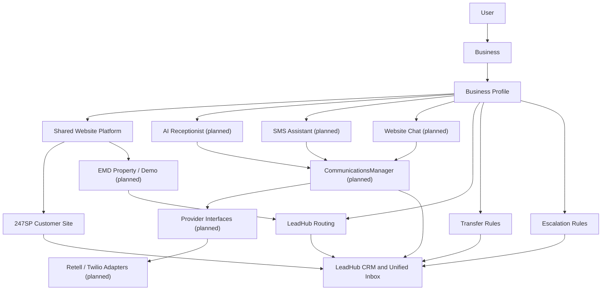

# Product Structure

## Purpose

This document defines the Ultimate Back Office product ecosystem.

It explains:

* Parent platform
* Customer-facing products
* Internal modules
* Product dependencies
* Current launch priority
* Which modules are visible or hidden

This document should be read before building new modules, onboarding flows, dashboards, pricing logic, or admin controls.

---

# Parent Platform

## Ultimate Back Office

Ultimate Back Office is the parent platform and operating system for local service businesses.

Ultimate Back Office includes:

* Accounts
* Business profiles
* Module activation
* Subscriptions
* Billing
* LeadHub
* 247SP
* Future financial, reputation, and lead marketplace tools

Ultimate Back Office is the umbrella brand.

---

# Core Account Structure

The system is organized as:

```text
User
  ↓
Business
  ↓
Business Profile
  ↓
Modules / Products
  ↓
Product Configuration
  ↓
Product Output
```

A user may own or manage one or more businesses.

A business may have one or more active modules.

Subscriptions represent the products and services connected to an account or business. Billing represents financial records such as payment status, invoices, charges, and fees. These are related but separate surfaces in the account navigation.

---

# Business Profile Architecture

The Shared Business Profile is the central business-knowledge layer for a business. Migration 021 established the initial schema and was staging validated. 247SP and future communications features should read authoritative facts from the profile and existing business/service records instead of creating disconnected setup records for each channel.

The reusable Shared Business Profile application service is implemented in `private/classes/SharedBusinessProfile.php`. It owns business authorization, tenant isolation, validation, transactions, lifecycle rules, live readiness calculation, normalized output, child ownership, and audit summaries. The customer-facing profile interface remains planned.

One Business Profile configures:

* Website
* AI Receptionist
* SMS Assistant
* Website Chat
* LeadHub routing
* Transfer rules
* Escalation rules

Business Profile configuration should answer:

* which channels are active
* which phone number, domain, email, and website belong to the business
* how inbound conversations are routed into LeadHub
* when AI can respond automatically
* when a conversation transfers to the owner or staff
* when a lead escalates because it is urgent, unanswered, high-value, or outside AI handling rules

Business Profile records own business-level intent and rules. Provider-specific IDs, tokens, webhook payloads, and API responses belong in provider-specific communication records behind internal UBO services.

The website is one presentation layer of these facts. Website page composition, component selection, and channel-specific wording belong to website presentation records. Shared facts may be worded differently for web, voice, SMS, and structured schema, but all wording must remain grounded in approved facts.

Migration 021 does not contain every future branding, trust, marketing, SEO, image, or media category. Each new concept must be reviewed against existing business, service, website, branding, media, and integration records before adding a field or child table.

---

# Communications Platform Architecture

247SP is planned to use a shared communications layer for AI voice, SMS, AI website chat, and phone-number/call infrastructure. The layer does not yet exist and should follow the same architectural pattern as Domain Services:

```text
Business Profile
  ↓
CommunicationsManager
  ↓
Provider Interfaces
  ↓
Provider Adapters
  ↓
External Providers
```

`CommunicationsManager` is the future internal orchestration service for channel setup, provider selection, routing, usage tracking, webhook normalization, and LeadHub record creation.

All external communications providers must be accessed through internal UBO services. Application routes, admin pages, customer pages, public webhooks, and LeadHub screens must not call Retell, Twilio, or future provider APIs directly.

Provider interfaces:

* `VoiceProviderInterface`: AI voice agent configuration, call session handling, transcripts, summaries, handoff metadata, usage minutes, and webhook normalization.
* `MessagingProviderInterface`: SMS/MMS sending, inbound message parsing, delivery status, segment counts, opt-out handling, and webhook normalization.
* `ChatProviderInterface`: AI website chat sessions, visitor messages, AI responses, transcripts, lead capture events, usage counts, and webhook normalization.
* `TelephonyProviderInterface`: local phone number search/provisioning, inbound call routing, outbound calls, call status, recordings, voicemail metadata, and webhook normalization.

Initial provider adapters:

* Retell Voice implements `VoiceProviderInterface`.
* Retell Chat implements `ChatProviderInterface`.
* Twilio Voice implements `TelephonyProviderInterface`.
* Twilio Messaging implements `MessagingProviderInterface`.

Future providers may implement the same interfaces without changing Business Profile rules, LeadHub routing behavior, customer navigation, or admin workflow code.

---

# Architecture Diagram



---

# Current Launch Priority

The first commercial product is:

```text
24/7 Sales Partner
```

All current development should prioritize making 247SP usable, sellable, manageable, and supportable.

Other modules exist in the platform structure but should remain hidden or unavailable until their sprint begins.

---

# Product Visibility Rules

## Visible Now

The following may be visible during the current 247SP build:

* 247SP
* LeadHub

LeadHub is visible because it is the central CRM and conversation system of record for 247SP.

---

## Hidden Until Future Sprints

The following should not be available to regular customers yet:

* EMD Network
* Super Simple Payments
* Tell Us How We Did
* Know Your Numbers
* Full OS
* Enterprise

These products are future modules.

They may exist in the database, documentation, or admin controls, but customers should not be able to self-activate or rely on them yet.

---

# LeadHub

LeadHub is the shared CRM, conversation inbox, and opportunity tracking layer.

It is not currently sold as a standalone product.

LeadHub is automatically included when a business activates:

* 247SP
* EMD Network
* Future lead-generating products

For 247SP customers, LeadHub should feel like part of the product experience, not a separate product purchase.

LeadHub is the central system of record for every 247SP communication channel, including website forms, AI website chat, business texting, inbound and outbound calls, AI receptionist summaries, supported email lead activity, manual notes, tasks, and follow-up history.

LeadHub is also the shared CRM feature area for the future Full OS navigation model.

---

# 24/7 Sales Partner

## Product Type

Standalone product and UBO module.

## Purpose

24/7 Sales Partner is a done-for-you lead-generation and digital-front-office platform powered by one structured Business Profile. It generates a custom website, captures forms, calls, texts, and chats, provides immediate AI-assisted responses, and keeps every opportunity organized in LeadHub.

In Standalone Module Mode, 247SP appears as "24/7 Sales Partner" in WORKSPACE navigation. In the future Full OS navigation model, the same capabilities should appear under feature areas such as CRM, Inbox, Phones, Websites, and Sales rather than as a standalone product name.

247SP includes:

* Done-for-you website
* Domain
* Professional email
* Local business phone number
* AI receptionist
* Business texting
* SMS Assistant
* AI website chat
* LeadHub CRM
* Unified conversation inbox

## Current Scope

247SP currently includes:

* Business onboarding
* Service selection
* Domain request storage
* Email mailbox request storage
* Website generation
* Private website preview
* LeadHub CRM foundation for contacts, notes, tasks, statuses, and activity
* Public website lead capture into LeadHub
* Website Manager and internal Admin Website Editor foundations
* Stripe billing and Domain Services foundations
* Shared Business Profile schema from migration 021

## Future Scope

Future 247SP sprints will include:

* Component-based website CMS, revisions, approval, and deployment lifecycle
* Shared 247SP/EMD website infrastructure and controlled conversion workflows
* Customer-facing Business Profile interface
* Email provisioning
* Local business phone number provisioning
* AI receptionist
* Business texting
* SMS Assistant
* AI website chat
* Unified conversation inbox
* Public publishing

## Shared Website Platform

247SP and EMD Network are planned to share site briefs, components, page generation, themes, analytics, SEO helpers, LeadHub form components, tracking, deployment, revision management, validation, and image handling. Product/site purpose determines whether leads route directly to a customer business or through the EMD routing engine.

The MVP is a structured done-for-you CMS, not a customer drag-and-drop builder. See `docs/247sp-website-generation-architecture.md`.

---

# 247SP Dependencies

247SP automatically includes:

* LeadHub

247SP does not require:

* SSP
* EMD
* TUHWD
* KYN
* Enterprise
* Full OS

---

# EMD Network

## Product Type

Future module.

## Purpose

Lead marketplace using exact match domains.

## Status

Not active for regular customer use.

Should remain hidden until its sprint begins.

---

# Super Simple Payments

## Product Type

Future module.

## Purpose

Simple estimates, invoices, payments, expenses, and financial tracking.

## Status

Not active for regular customer use.

Should remain hidden until its sprint begins.

---

# Tell Us How We Did

## Product Type

Future module.

## Purpose

Review funnel and customer feedback collection.

## Status

Not active for regular customer use.

Should remain hidden until its sprint begins.

---

# Know Your Numbers

## Product Type

Future module.

## Purpose

Financial reporting, bookkeeping insights, and business metrics.

## Status

Not active for regular customer use.

Should remain hidden until its sprint begins.

---

# Full OS

## Product Type

Future package.

## Purpose

Full Ultimate Back Office operating system bundle.

## Behavior

Full OS should include all active core modules when the OS is ready.

Full OS customers should use feature-area navigation instead of standalone product navigation:

```text
Dashboard
CRM
Websites
Sales
Payments
Reviews
Operations
Accounting
Reports
Settings
```

The feature areas may map to existing modules internally, but the customer-facing model should feel like one operating system rather than a collection of separate products.

## Status

Not available for regular customer self-selection during the 247SP-only launch phase.

---

# Enterprise

## Product Type

Future account level.

## Purpose

Allows ownership or management of multiple businesses under one account.

Enterprise sits above individual business modules.

It is not the same thing as a business module.

## Status

Not available for regular customer self-selection during the 247SP-only launch phase.

---

# Module Activation Rules

## Current 247SP Launch Phase

Customer-facing module activation should allow only:

* 247SP

When 247SP is activated, the system should automatically activate:

* LeadHub

Customers should not self-activate:

* EMD
* SSP
* TUHWD
* KYN
* Full OS
* Enterprise

---

# Admin Module Controls

Admins may view all modules.

Admins may enable or disable modules for testing.

Admin controls should clearly distinguish between:

* Available customer products
* Internal/future modules
* Test-only modules

---

# Customer Dashboard Rules

For normal customers, dashboards should only show:

* Active usable modules
* Products they can access
* Products that are actually implemented

Do not show placeholders for unfinished modules unless intentionally marked as coming soon.

---

# Current Milestone

As of Sprint 4, the platform has proven:

```text
Account
→ Business
→ 247SP activation
→ Onboarding
→ Website generation
→ Private preview
```

This is the early website-preview workflow inside 247SP. It is not the full current 247SP product definition.

It is not yet first paying customer ready.

---

# Before First Paying Customer

Required before taking paying customers:

* Production deployment
* Real OTP delivery
* Module gating
* Payment/billing workflow
* Customer-safe module visibility
* Front-office management tools
* Admin support visibility
* LeadHub as the unified system of record for website forms, AI chat, calls, texts, AI receptionist activity, and supported email lead activity
* Local phone, texting, AI receptionist, and AI website chat provisioning
* Basic operational workflow

---

# Development Rule

When building new features, always ask:

```text
Does this support the current 247SP launch path?
```

If not, defer it unless it is required for platform stability.

The current 247SP launch path is the digital front-office product path, not a standalone website-builder path.
